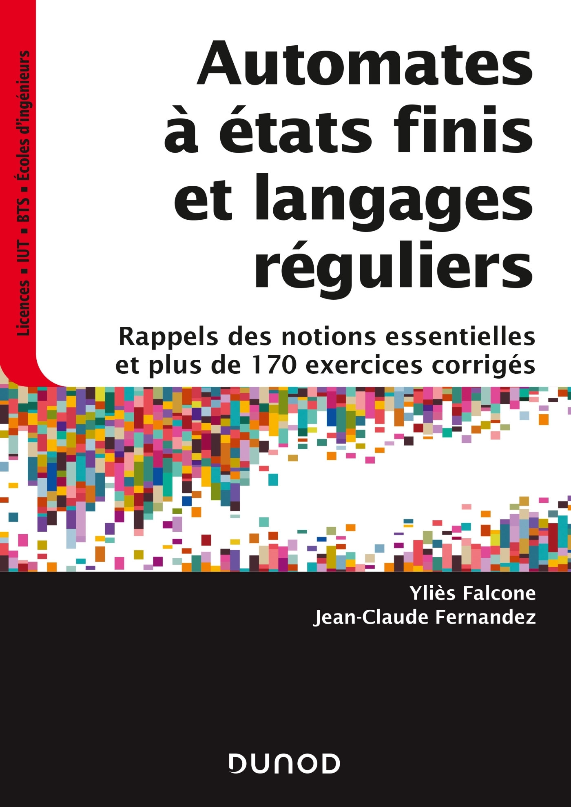
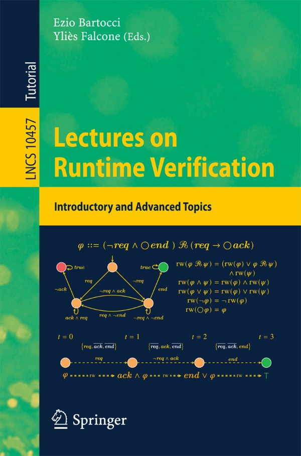

At Univ. Grenoble Alpes, I have regularly taught the following courses at the Bachelor and Master levels:

<ul>
    <li>Automata and Regular Language Theory</li>
    <li>Functional Algorithmic and Programming with OCaml</li>
    <li>Semantics of Programming Languages and Compiler Design</li>
    <li>Logic and Proof Techniques</li>
    <li>Object-oriented Design and Programming</li>
    <li>Runtime Verification</li>
    <li>Research Project Introduction</li>
</ul>

A book I co-authored and one I co-edited to support the teaching of automata theory and runtime verification.

<!-- Container with Flexbox layout via inline styles -->

  

  

I also co-supervised the first year of the International Master in Computer Science.

I also gave invited lectures in other universities:

<ul>
    <li>Universidad Pontifica Javeriana (Colombia): Intro to Model Checking</li>
    <li>University of Galatasaray (Turkey): Semantics of Programming Languages and Introduction to Runtime Verification</li>
    <li>Polytechnique Yaoundé: Semantics of Programming Languages and Compiler Design</li>
    <li>American University of Beirut: Introduction to Runtime Verification</li>
</ul>
