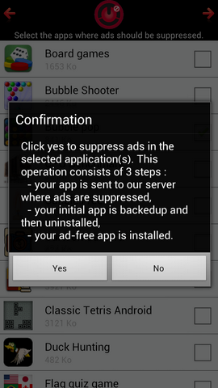

MiDroid encompasses applications for 1) improving the security of Android applications 2) allowing users to gain control back of their Android devices (when fine-grained permissions did not exist).
MiDroid uses aspect-oriented programming to modify and monitor the behavior of a given applications without knowing its source code.

MiDroid was the foundational technology of an entreprenarial activity supported by Univ. Grenoble Alpes and Institut Carnot.

MiDroid was also the underlying technology demonstrated in research publications:
,
,
,
,
.

Below are some screen captures of the UI back then:

 <!-- Container with Flexbox layout via inline styles -->

    
    

